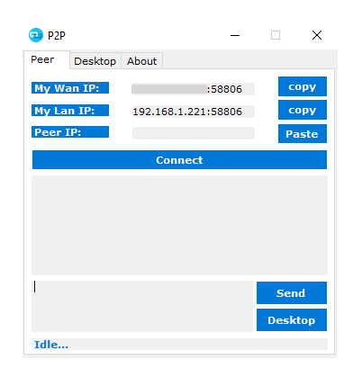
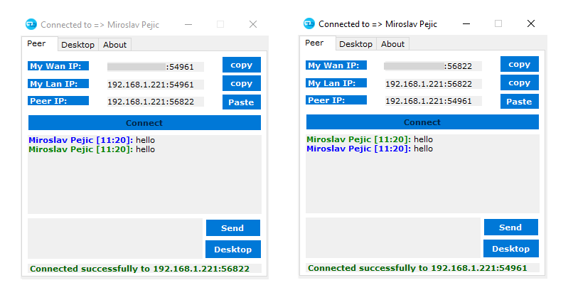
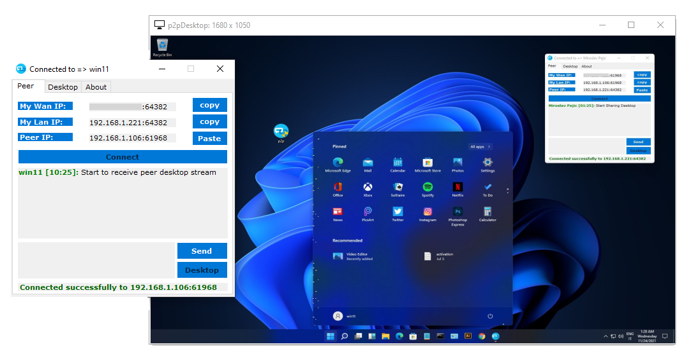
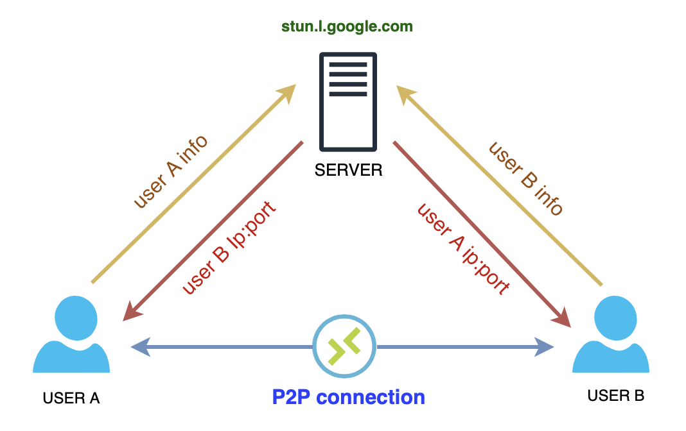

  

# 
P2P 远程桌面

基于 P2P 的远程桌面 · 便携、免安装、免配置

## 工作原理

- 编译并在两台不同 PC 上以管理员身份运行 `p2p.exe`。

- 复制 `我的公网 IP` 或 `我的内网 IP`，发给对方，反之亦然。

- 双方拿到彼此的两个端点信息后，分别点击 `连接`。
- 连接成功后即可 `发送消息` 或对对方进行 `远程桌面控制`。

 

应用基于 [UDT 协议](https://en.wikipedia.org/wiki/UDP-based_Data_Transfer_Protocol)，
借助 `rendezvous` 会合连接，能够 `穿透大多数防火墙规则`，
可以说是一个零成本的微型 `TeamViewer`！

## 说明

本项目为开源项目，没有 `数字签名`，杀毒软件可能会误报 `false positive`。
从源码自行编译时，可将项目加入杀毒软件白名单。感谢理解。

## 贡献

欢迎并衷心感谢任何形式的贡献！

## 许可

## 支持

